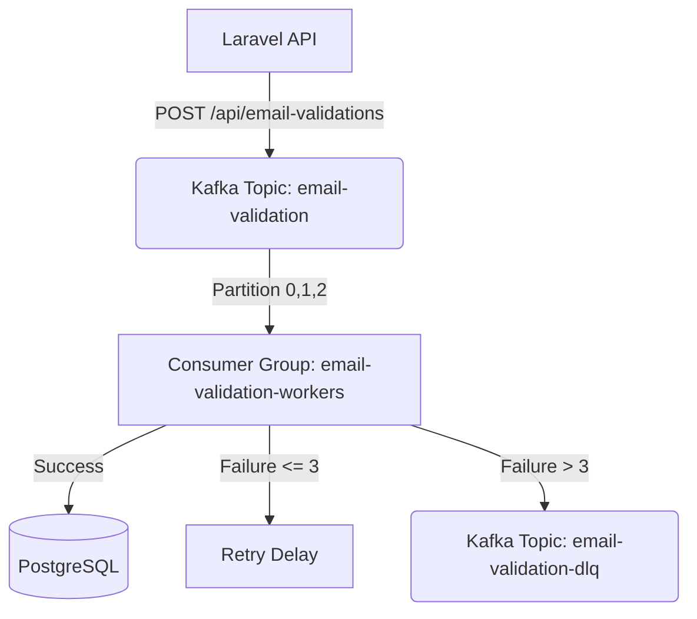

# System Architecture

## Overview
This document describes the architectural layout of the Email Validation Event Processing System. We use a producer-consumer setup with Laravel to publish messages to Kafka and a long-running console command to consume and process those messages asynchronously.

## Flow Diagram

## Key Components
1. **Laravel API:** Exposes endpoints to accept email addresses and immediately publish them to Kafka, returning HTTP 202.
2. **Kafka Broker:** Hosts topics and handles partitioned message streaming.
3. **Consumer Workers:** Long-running CLI processes `php artisan kafka:consume-email-validations` that read from Kafka partitions, validate the email logic, handle retries, and write to PostgreSQL.
4. **PostgreSQL DB:** The persistence layer that holds final states (valid/invalid) for the email addresses.
5. **Dead Letter Queue (DLQ):** Captures messages that fail after maximum retry attempts.
